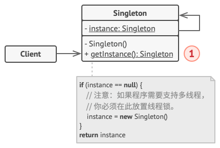

### 工厂方法模式

**工厂方法模式**是一种创建型设计模式， 其在父类中提供一个创建对象的方法， 允许子类决定实例化对象的类型。

#### 结构

1. **产品** （Product） 将会对接口进行声明。 对于所有由创建者及其子类构建的对象， 这些接口都是通用的。

2. **具体产品** （Concrete Products） 是产品接口的不同实现。

3. **创建者** （Creator） 类声明返回产品对象的工厂方法。 该方法的返回对象类型必须与产品接口相匹配。

   你可以将工厂方法声明为抽象方法， 强制要求每个子类以不同方式实现该方法。 或者， 你也可以在基础工厂方法中返回默认产品类型。

   注意， 尽管它的名字是创建者， 但他最主要的职责并**不是**创建产品。 一般来说， 创建者类包含一些与产品相关的核心业务逻辑。 工厂方法将这些逻辑处理从具体产品类中分离出来。 打个比方， 大型软件开发公司拥有程序员培训部门。 但是， 这些公司的主要工作还是编写代码， 而非生产程序员。

4. **具体创建者** （Concrete Creators） 将会重写基础工厂方法， 使其返回不同类型的产品。

   注意， 并不一定每次调用工厂方法都会**创建**新的实例。 工厂方法也可以返回缓存、 对象池或其他来源的已有对象。

#### 优缺点

优点：

1. 避免创建者和具体产品之间的紧密耦合。
2.  单一职责原则。 你可以将产品创建代码放在程序的单一位置， 从而使得代码更容易维护。
3. 开闭原则。 无需更改现有客户端代码， 你就可以在程序中引入新的产品类型。

缺点：

1. 应用工厂方法模式需要引入许多新的子类， 代码可能会因此变得更复杂。 最好的情况是将该模式引入创建者类的现有层次结构中。

#### 适用场景

---

### 抽象工厂模式

**抽象工厂模式**是一种创建型设计模式， 它能创建一系列相关的对象， 而无需指定其具体类。

#### 结构

1. **抽象产品** （Abstract Product） 为构成系列产品的一组不同但相关的产品声明接口。
2. **具体产品** （Concrete Product） 是抽象产品的多种不同类型实现。 所有变体 （维多利亚/现代） 都必须实现相应的抽象产品 （椅子/沙发）。
3. **抽象工厂** （Abstract Factory） 接口声明了一组创建各种抽象产品的方法。
4. **具体工厂** （Concrete Factory） 实现抽象工厂的构建方法。 每个具体工厂都对应特定产品变体， 且仅创建此种产品变体。
5. 尽管具体工厂会对具体产品进行初始化， 其构建方法签名必须返回相应的抽象产品。 这样， 使用工厂类的客户端代码就不会与工厂创建的特定产品变体耦合。 **客户端** （Client） 只需通过抽象接口调用工厂和产品对象， 就能与任何具体工厂/产品变体交互。

#### 优缺点

优点：

1. 可以确保同一工厂生成的产品相互匹配。
2. 可以避免客户端和具体产品代码的耦合。
3. **单一职责原则**。 你可以将产品生成代码抽取到同一位置， 使得代码易于维护。
4.  **开闭原则**。 向应用程序中引入新产品变体时， 你无需修改客户端代码。

缺点：

1. 由于采用该模式需要向应用中引入众多接口和类， 代码可能会比之前更加复杂。

#### 适用场景

---

### 生成器模式

**生成器模式**是一种创建型设计模式， 使你能够分步骤创建复杂对象。 该模式允许你使用相同的创建代码生成不同类型和形式的对象。

#### 结构

1. **生成器** （Builder） 接口声明在所有类型生成器中通用的产品构造步骤。
2. **具体生成器** （Concrete Builders） 提供构造过程的不同实现。 具体生成器也可以构造不遵循通用接口的产品。
3. **产品** （Products） 是最终生成的对象。 由不同生成器构造的产品无需属于同一类层次结构或接口。
4. **主管** （Director） 类定义调用构造步骤的顺序， 这样你就可以创建和复用特定的产品配置。
5. **客户端** （Client） 必须将某个生成器对象与主管类关联。 一般情况下， 你只需通过主管类构造函数的参数进行一次性关联即可。

#### 优缺点

优点：

1. 可以分步创建对象， 暂缓创建步骤或递归运行创建步骤。
2. 生成不同形式的产品时， 你可以复用相同的制造代码。
3. 单一职责原则。 可以将复杂构造代码从产品的业务逻辑中分离出来。

缺点：

1. 由于该模式需要新增多个类， 因此代码整体复杂程度会有所增加。

#### 适用场景

1. 使用生成器模式可避免 **重叠构造函数** （telescopic constructor）的出现。
2. 使用代码创建不同形式的产品时，可以使用生成器模式。

---

### 单例模式

**单例**是一种创建型设计模式， 让你能够保证一个类只有一个实例， 并提供一个访问该实例的全局节点。

#### 结构

实现方式：

1. 在类中添加一个私有静态成员变量用于保存单例实例。
2. 声明一个公有静态构建方法用于获取单例实例。
3. 在静态方法中实现"延迟初始化"。 该方法会在首次被调用时创建一个新对象， 并将其存储在静态成员变量中。 此后该方法每次被调用时都返回该实例。
4. 将类的构造函数设为私有。 类的静态方法仍能调用构造函数， 但是其他对象不能调用。
5. 检查客户端代码， 将对单例的构造函数的调用替换为对其静态构建方法的调用。

#### 优缺点

优点：

1. 可以保证一个类只有一个实例。
2. 获得了一个指向该实例的全局访问节点。
3. 仅在首次请求单例对象时对其进行初始化（懒加载）。

缺点：

1. 多线程环境下需要进行特殊处理， 避免多个线程多次创建单例对象。
2. 单例类的职责过重，违反了单一职责原则。

#### 适用场景

1. 如果程序中的某个类对于所有客户端只有一个可用的实例，可以使用单例模式。
2. 如果需要更加严格地控制全局变量，可以使用单例模式。

---

### 原型模式

**原型模式**是一种创建型设计模式， 使你能够复制已有对象， 而又无需使代码依赖它们所属的类。

> Java 的 `Cloneable` （可克隆） 接口就是立即可用的原型模式。

1. **原型** （Prototype） 接口将对克隆方法进行声明。 在绝大多数情况下， 其中只会有一个名为 `clone`克隆的方法。
2. **具体原型** （Concrete Prototype） 类将实现克隆方法。 除了将原始对象的数据复制到克隆体中之外， 该方法有时还需处理克隆过程中的极端情况， 例如克隆关联对象和梳理递归依赖等等。
3. **客户端** （Client） 可以复制实现了原型接口的任何对象。

#### 优缺点

优点：

1. 可以克隆对象， 而无需与它们所属的具体类相耦合。
2. 可以克隆预生成原型， 避免反复运行初始化代码。
3. 更方便地生成复杂对象。
4. 可以用继承以外的方式来处理复杂对象的不同配置。

缺点：

1. 克隆包含循环引用的复杂对象可能会非常麻烦。

#### 适用场景